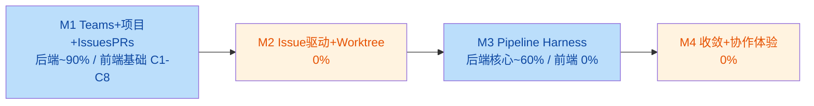

# Orca 团队协作模块 - 进度追踪

> 用途：站在 ROADMAP 角度追踪当前进度、已完成/未完成对照、依赖链缺口与下一步方向，避免迭代偏差。
> 维护约定：每轮迭代收口后更新本文档（§4 索引、§3 状态、§7 估算、§8 序列）。

## 1. 项目状态总览（2026-08-19，R14 收口）

**定位**：在 Orca（Electron 桌面端 AI 协作编码工具）之上叠加团队协作模块。当前处于 **M1 后端收口 + M3 Harness 基础提前完成 + M1 前端基础（C1-C8）落地** 的阶段——进度呈"跳跃式"，不是按 M1→M2→M3 线性推进。R13 收口后 M1 前端具备"项目接入→团队管理→**Issue 列表/详情读写**"闭环（两个协作入口 + Teams/IssuesPRs 页 + 项目接入引导 + ProjectTeam 面板 + IssueList/IssueDetail（状态/优先级原地编辑，零后端改动）+ preload 通道打通，changeOwner 原子切换）。



**当前测试基线**：后端协作 + CLI 命令全集 69 文件 / **893 tests** 全绿（`tsc --noEmit -p config/tsconfig.node.json` exit 0，oxlint 0）；渲染层 tests 全绿（`typecheck:tsc:web` 0 错误——早期"16 个 TS6307 预存"为 stale tsbuildinfo 伪象，权威 `--composite false` 运行实为 0）；协作库 `SCHEMA_VERSION = 5`。

## 2. 里程碑进度对照

| 里程碑 | 范围（ROADMAP §2） | 当前状态 | 缺口 |
|--------|--------------------|----------|------|
| M1 Teams + 项目接入 + IssuesPRs 基础 | 第 1-3 周 | 后端完成大部分；前端基础（C1-C9）落地 | B2/B6/B7/A5 后端 |
| M2 Issue 驱动 + Worktree 自动分配 | 第 4-5 周 | 未开始 | D1-D7 全部 |
| M3 Pipeline Harness + Agent 协作 | 第 6-8 周 | Harness 骨架 + E1 CLI（Agent 可操作 Issue） | E3/E5/E6/E7 + convergence-rules |
| M4 收敛机制 + 协作体验 + 并行优化 | 第 9-10 周 | 未开始 | F1-F7 全部 |

## 3. 任务包状态矩阵

| 任务包 | 内容 | 状态 | 详情 |
|--------|------|------|------|
| A 数据层与基础设施 | A1-A5 | **80%** | A1 ✅ 数据库入口+迁移；A2 ✅ 10 张表（v5）；A3 ✅ 领域类型；A4 ✅ Store 层封装；**A5 activity-log ❌** |
| B 主进程协作域服务 | B1-B8 | **70%** | B1 ✅ TeamStore；B3 ✅ ProjectStore（markGitInitialized）；B4 ✅ 项目团队（project-store 内）；B5 ✅ IssueStore；**B6 ✅ pr-store ++（最小版：listByProject/get/update/nextPrNumber/create 测试用，行映射 rowToPr + JSON.parse，经复核修复）**；B8 ✅ 协作 IPC（team/project/issue/**pr**）；**B2 agent-config ❌、B7 git-ref-registry ❌** |
| C 渲染层导航与基础页面 | C1-C9 | **95%** | **C1 ✅ activeView 扩展 + C2 ✅ 导航历史扩展 + C3 ✅ Sidebar Teams/IssuesPRs 入口 + C4 ✅ TeamsPage 骨架 + C5 ✅ IssuesAndPRsPage 骨架 + C6 ✅ 项目接入引导 + C7 ✅ 项目团队管理 UI + C8 ✅ Issue 列表/详情页 + C9 ✅ PR 列表/详情页**（C8 含 IssueList + IssueDetail（状态/优先级原地编辑，零后端改动），经复核修复详情默认可见；C9 含 PRList + PRDetail + 后端 B6 最小版 pr-store + pr:* IPC + preload collaboration.pr，复用 C8 面板范式，status 三档原地编辑，选中默认展示详情，经复核修复 rowToPr 行映射缺口 + JSON.parse reviewers/approvals） |
| D Issue 驱动执行链路 | D1-D7 | **0%** | 全部未开始（生命周期/worktree 分配/terminal+Agent 启动/状态联动） |
| E Harness 与协作能力 | E1-E7 | **~60%** | E1 ✅ Pipeline CLI（`orca issue` comment/update/get/list + 协作域 Agent 侧 RPC，一轮修复补发起者→项目团队校验）；E2 ✅ harness-engine；E2a ✅ execution-context；E2b ✅ agent-runner；E2c ✅ stream-event-normalizer；E4 ✅ owner-collaboration(+issue-comment-store)；**E3 角色工作流配置 ❌、E5 pipeline-tracker ❌、E6/E7 UI ❌** |
| F 收敛、恢复与质量保障 | F1-F7 | **0%** | 全部未开始 |

## 4. 已完成迭代记录索引

| 迭代 | 沉淀文档 | 核心产出 |
|------|----------|----------|
| R2 | `multi-agent-iteration/2026-08-14-round2-review-fix.md` | 数据层 MVP 审查收口（TeamStore + DB，canDelete 门禁） |
| R3 | `multi-agent-iteration/2026-08-14-round3-project-issue-store.md` | B3 ProjectStore + B5 IssueStore；git 状态改纯持久化 |
| R4 | `multi-agent-iteration/2026-08-14-round4-store-hardening.md` | Store 加固：removeMember worktree/issue 校验、owner ∈ 项目团队 |
| R5 | `multi-agent-iteration/2026-08-14-round5-collaboration-ipc.md` | B8 协作 IPC（team.* / project.* / issue.* + Zod 校验） |
| R6 | `multi-agent-iteration/2026-08-17-round6-harness-foundation.md` | E2 系列：上下文快照/Prompt 分层/Runner 统一接口/事件归一化/withPolicy |
| R7 | `multi-agent-iteration/2026-08-17-round7-owner-collaboration.md` | E4 评论回写闭环 + IssueCommentStore（含 A/B 收口） |
| R8 | `multi-agent-iteration/2026-08-17-round8-activeview-nav-history.md` | C1-C2 前端基础：activeView 支持 issues-and-prs/teams + 导航历史扩展（208 渲染层 tests） |
| R9 | `multi-agent-iteration/2026-08-17-round9-sidebar-teams-issues-pages.md` | C3-C5: Sidebar Teams/IssuesPRs 入口 + Teams/IssuesPRs 页骨架 + preload 20 通道暴露（254 渲染层 tests）；经两轮复核修复（竞态/编辑/字段/文档数字/lint 清零） |
| R10 | `multi-agent-iteration/2026-08-17-round10-pipeline-cli-issue.md` | E1 Pipeline CLI：`orca issue` comment/update/get/list + 协作域 Agent 侧 RPC（comment/update）打通真实执行链；经复核修复（发起者→项目团队权限校验 / array-type lint / 文档数字）→ 893 tests |
| R11 | `multi-agent-iteration/2026-08-17-round11-project-onboarding.md` | C6 项目接入引导：多步引导对话框（source→confirm→git→done）+ git 探测/init 薄通道（复用 isGitRepo）；经复核修复（oxlint 3 errors + 激活工作区接线）→ 258 渲染层 tests |
| R12 | `multi-agent-iteration/2026-08-18-round12-project-team-ui.md` | C7 项目团队管理 UI：ProjectTeam 面板（成员/角色/邀请/移除）+ changeOwner 原子切换；经二轮复核修复（A1 preload listMembers 类型标注错→6 处 tsc 硬错误 / B1 changeOwner 事务边界）→ `typecheck:tsc:web` 0 错误、node tsc 0、oxlint 0 |
| R13 | `multi-agent-iteration/2026-08-19-round13-issue-list-detail.md` | C8 Issue 列表/详情页：IssueList + IssueDetail（状态/优先级原地编辑，复用 `issue.update`，零后端改动）；经复核一轮修复（详情默认可见/优先级变更测试缺失/token 配色/文档分布数字/aria-label）→ issues-and-prs 46 tests、node+web tsc 0、oxlint 0 |
| R14 | `multi-agent-iteration/2026-08-19-round14-pr-list-detail.md` | C9 PR 列表/详情页 + B6 最小版：PRList + PRDetail（status 三档原地编辑，复用 C8 面板范式，选中默认展示详情）+ pr-store（listByProject/get/update/nextPrNumber/create 测试用）+ pr:* IPC + preload collaboration.pr；经复核修复（首次发现 rowToPr 行映射缺口 + reviewers/approvals JSON.parse，二次复核确认 + 校正文档分布数字）→ issues-and-prs 69 tests + 后端 33 tests 全绿 |

## 5. 已确立的硬性约定（防偏差的关键，后续每轮必须遵守）

1. **Project = Orca 打开的文件夹**；Teams 是公司级，项目团队从 Teams 抽调，成员必须 ∈ 项目团队才可执行任务
2. **owner 必须属于项目团队**（Issue create/update/reopen 均校验，`assertOwnerInProject` 模式）
3. **删除保护**：`TeamStore.delete()` / `removeMember()` 必须经 `canDelete()` 门禁（活跃 worktree / 项目 / Issue / PR 约束）
4. **Git 状态只经 `markGitInitialized` 写回**，Store 层不做本地探测；host-aware 探测属 IPC/runtime 层
5. **Harness 是运行时约束层，不是固定流程模板**；Prompt 分层（systemPrompt=角色/规则，userPrompt=场景/任务）；运行时上下文必须显式
6. **worktreePath 是真实文件系统路径，不是 worktree 实体 ID**
7. **评论默认项目团队可见**，不做内外隔离；负责人是推荐对外同步者，不封堵成员评论
8. **确定性总结，不用 LLM** 生成运行总结（事实由系统落库）
9. **数据库用 `node:sqlite`**（技术决策，偏离 ROADMAP 原文的 better-sqlite3）；`PRAGMA foreign_keys = ON`；迁移用 `PRAGMA user_version` 事务包裹；POSIX `chmodSync(0o600)`
10. **禁止重犯清单**（源自 R6，后续所有轮次自查）：不用 fixture 掩盖缺口 / 无虚假声明 / 无死代码 / 不漏 invariant / 不语义混淆 / 文档数字与实现一致 / 不扩大范围
11. **发起者必须 ∈ 项目团队才允许改变 Issue 状态/字段**（RPC 层的操作链强制；owner 校验只管 owner ∈ 项目团队，发起者校验不可省，二者都防漏）

## 6. 依赖链缺口与风险

| 缺口 | 影响 | 处理建议 |
|------|------|----------|
| **E5 依赖 D1** | pipeline-tracker 完整开工需 Issue 生命周期（D1） | E1 已落地（R10）；Issue 级事件可先做，完整版本等 D1 |
| **E2b 真实 runner** | 目前只有 Mock runner | E1 CLI 已落地（R10）；接真实 CLI 适配 + 补 `AbortController` 取消机制（R6 遗留观察项） |
| **C 系列前端依赖 B8（已完成）** | 前端 C1-C9 已落地 | C 系列已全部完成，转 D/E 系列 |
| **B7 git-ref registry / B2 agent-config / A5 activity-log** | M1 后端未收口项 | M2 前补齐，用于 PR/worktree 闭环 |
| **D2/D4 依赖 Orca Runtime 集成** | worktree 分配 + terminal/Agent 启动未落地 | 需接 `createManagedWorktree` / `createTerminal`；M2 是"骨架→真实运行"的关键一跳 |
| **多宿主（SSH/WSL/remote）** | 现有代码以 local 为主 | 按 ROADMAP M4-5 验收标准，产品层只分有 Git/无 Git，执行复用 Orca |

## 7. 剩余工作量估算

按"每轮一个最小闭环"粒度：

| 阶段 | 任务 | 预估 Round |
|------|------|-----------|
| M1 收口（后端） | B6 PR Store 最小版已补（R14）；B7 git-ref / B2 agent-config / A5 activity-log | 2 |
| M1 交付（前端） | C9（PR 列表/详情）已完成（R14）；C1-C9 全部落地 | 0 |
| M2 Issue 驱动 | D1-D5（生命周期 + worktree 分配 + terminal/Agent 启动 + 负责人集成） | 3 |
| M2 联动 | D6-D7（Issue 详情 worktree 展示 + 状态联动） | 1 |
| M3 收口（后端） | E5 tracker → E3 角色工作流配置（E1 CLI 已完成 R10） | 2 |
| M3 收口（前端） | E6 Pipeline 可视化 + E7 负责人视图 | 1-2 |
| M4 收敛 | F1-F4（收敛规则 + 上报 + 对账 + 并行约束） | 2-3 |
| 质量收尾 | F5-F7（测试补齐 + 集成 + E2E） | 2 |

**合计：约 13-15 个 Round 剩余**（约等于 ROADMAP 剩余 6-7 周左右规划量）。估算为相对粒度，实际受任务大小影响。

## 8. 建议的下一步序列（当前建议）

```
Round 8:   ✅ C1-C2  activeView 扩展 + 导航历史（前端基础，已收口）
Round 9:   ✅ C3-C5  Sidebar 入口 + Teams 页 + IssuesPRs 页骨架（前端骨架，已收口）
Round 10:  ✅ E1     Pipeline CLI 最小版（orca issue comment/update/get/list，已收口）
Round 11:  ✅ C6     项目接入引导（已收口）
Round 12:  ✅ C7     项目团队管理 UI（ProjectTeam 面板 + changeOwner 原子切换，含 A1/B1 二轮复核收口）
Round 13:  ✅ C8     Issue 列表/详情页（IssueList + IssueDetail，零后端改动；含一轮复核修复收口）
Round 14:  ✅ C9     PR 列表/详情页 + B6 最小版（PRList + PRDetail + pr-store + pr:* IPC + preload；经二轮复核修复 rowToPr 行映射缺口，已收口）
```

原则：**先补前端让 M1 可见可用，再回后端打通 D/E 依赖链**，保证每轮有可演示闭环。若排期冲突，优先级为：C 系列（M1 可用性）> E5（依赖 E1 已就绪，可抢先做 Issue 级）> D 系列（M2）> E6/E7 UI。

## 9. 当前状态校验命令

```bash
PATH="$HOME/.nvm/versions/node/v24.14.0/bin:$HOME/Library/pnpm:$PATH" pnpm vitest run src/cli/ src/main/runtime/collaboration/*.test.ts src/main/ipc/collaboration-ipc.test.ts src/main/runtime/pipeline/*.test.ts src/main/runtime/rpc/methods/collaboration-issues.test.ts
PATH="$HOME/.nvm/versions/node/v24.14.0/bin:$HOME/Library/pnpm:$PATH" pnpm tsc --noEmit -p config/tsconfig.node.json
```

> 预期：69 文件 / 893 tests 全绿；tsc exit 0；oxlint 0。
